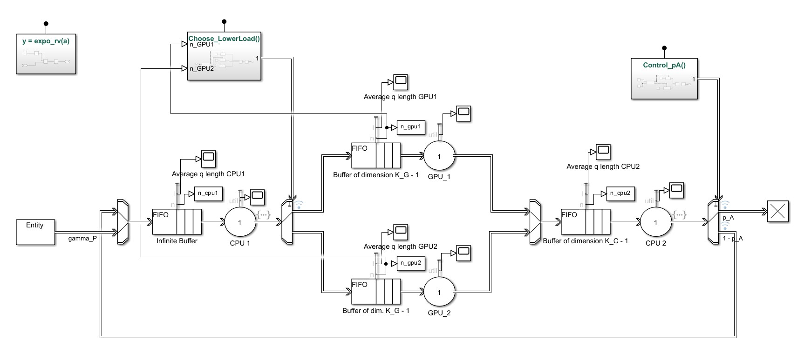
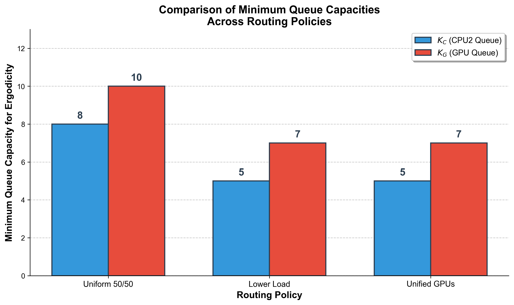
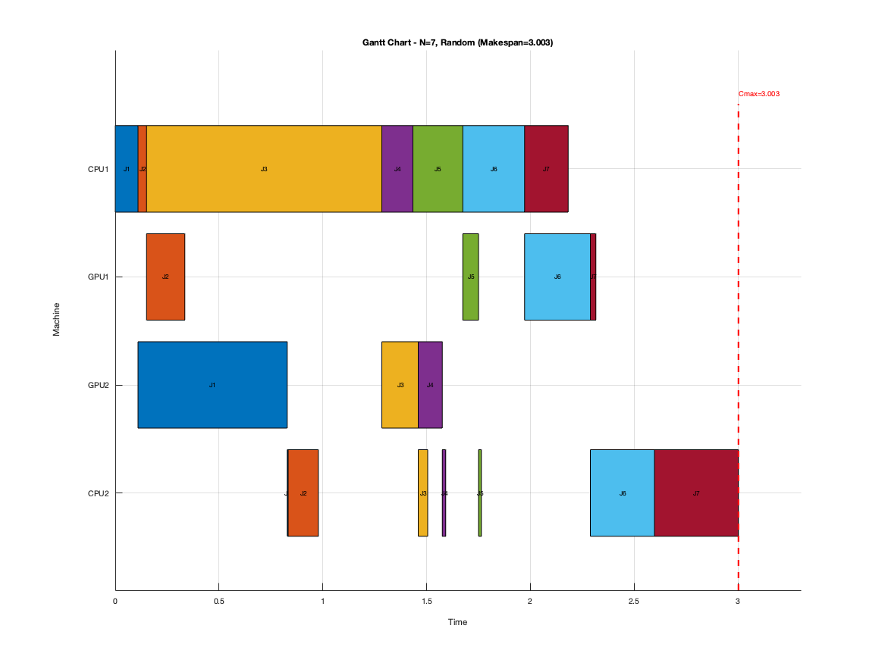
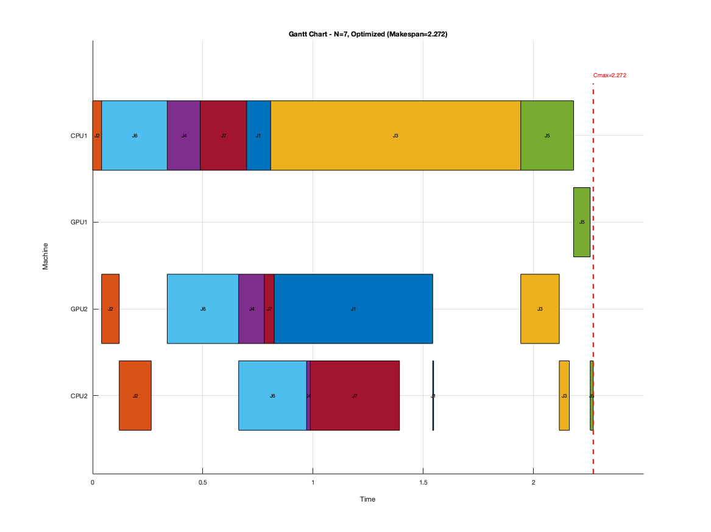

  <h1>SLM Queueing Analysis and Scheduling Optimization</h1>
  <h3>Optimization and Simulation for Industrial Automation</h3>

This repository contains the codebase for analyzing and optimizing the computational pipeline of a Small Language Model (SLM). The project was developed with [Ali Vaezi](https://github.com/aliivaezii) for the *Optimization and Simulation for Industrial Automation* course at Politecnico di Torino.

The system models a flow-shop architecture where prompts pass through a pre-processing CPU (CPU 1), a parallel GPU inference stage (GPU 1 and GPU 2), and a post-processing CPU (CPU 2). We evaluated the system under two distinct operational scenarios: using Discrete-Event Simulation and Integer Linear Programming (ILP).

  

## Prerequisites & Technologies

- **Languages:** MATLAB
- **Simulation:** Simulink, SimEvents
- **Optimization:** MATLAB Optimization Toolbox
- **Core Concepts:** Queueing Theory (M/M/1, M/M/2/K), Flow-Shop Scheduling, Big-M Formulation.

## 1. Scenario 1: Human User (Queueing Simulation)

This scenario analyzes the system under continuous Poisson arrivals ($\gamma_P = 5$ prompts/min) to determine the minimum buffer capacities ($K_C$, $K_G$) required to prevent back-pressure and guarantee system ergodicity (stability).

- **Routing Policies Evaluated:** 
  1. *Uniform Probability (50/50)*: Random GPU assignment.
  2. *Lower Load Queue*: Dynamic routing to the least congested GPU.
  3. *Unified GPUs (M/M/2/K)*: Theoretical optimum with a shared buffer.

**Key Findings:** The "Lower Load" dynamic routing policy reduced the total required buffer capacity by **33%** (from $K_{tot}=18$ to $K_{tot}=12$) compared to naive random assignment, perfectly matching the theoretical optimum of a unified M/M/2/K queue.

  

### Execution
Navigate to the `Scenario1_Simulation/src` directory and run the main simulation script:

    run Scenario1_HumanUser.m

## 2. Scenario 2: Agent (Batch Scheduling Optimization)

This scenario focuses on processing a known batch of $N$ prompts arriving simultaneously. It compares naive random processing against a mathematically optimized schedule.

- **ILP Formulation:** Minimizes the total makespan ($C_{max}$) by optimizing job sequences on shared resources and routing assignments to parallel GPUs using a Big-M formulation.

**Key Findings:** The ILP optimization consistently outperformed random scheduling, achieving an average makespan reduction between **21% and 34%**. Peak improvements were observed for medium-sized batches ($N=7$) due to superior GPU load balancing and optimal job sequencing.

  
  

### Execution
Navigate to the `Scenario2_Optimization/src` directory and run the batch optimization script:

    run Scenario2_Agent.m